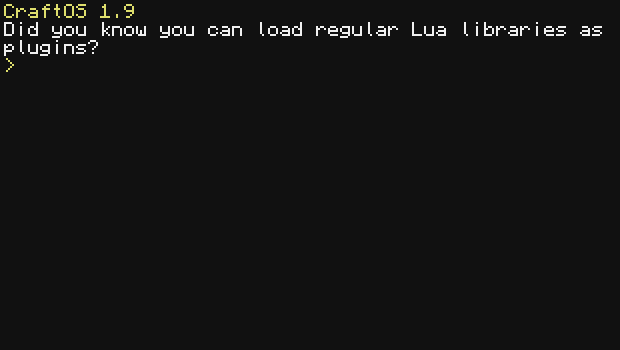

# Computer Craft Package Manager

> The package manager for ComputerCraft and ComputerCraft: Tweaked with Pinestore (and more) support.



[![Download on PineStore](https://raster.shields.io/badge/dynamic/json?url=https%3A%2F%2Fpinestore.cc%2Fapi%2Fproject%2F273&query=%24.project.downloads&suffix=%20downloads&logo=data%3Aimage%2Fsvg%2Bxml%3Bbase64%2CPD94bWwgdmVyc2lvbj0iMS4wIiBlbmNvZGluZz0iVVRGLTgiPz4KPHN2ZyB3aWR0aD0iNzYuOTA0IiBoZWlnaHQ9Ijg5LjI5NSIgcHJlc2VydmVBc3BlY3RSYXRpbz0ieE1pZFlNaWQiIHZlcnNpb249IjEuMSIgdmlld0JveD0iMCAwIDc2OS4wNCA4OTIuOTUiIHhtbG5zPSJodHRwOi8vd3d3LnczLm9yZy8yMDAwL3N2ZyI%2BCiA8ZyB0cmFuc2Zvcm09InRyYW5zbGF0ZSgtMTQuNzQgLTQuNjgyNikiIGZpbGw9IiM5YWIyZjIiPgogIDxwYXRoIGQ9Im00MTAgODUxYzAtMTIgMjYtMjEgNTgtMjEgMTUgMCAyMiA0IDE3IDktMTQgMTItNzUgMjItNzUgMTJ6Ii8%2BCiAgPHBhdGggZD0ibTU4NSA3NDJjLTEtNDkgNC03MiAxNi04NSAyMi0yNCAzMC02OCAxNi04Ni0xMi0xNC0yNy0zOS00OC03OC0xMC0xOS05LTI2IDQtNDEgMjItMjQgMjEtNjctMi0xNDQtMjEtNjktMzktMTQ0LTQ4LTE5NS00LTI2LTItMzMgMTEtMzMgMzEgMCAxMTIgMzMgMTQxIDU4IDI4IDIzIDgxIDkyIDcxIDkyLTIgMCA1IDI2IDE2IDU3IDI4IDc5IDI5IDIyNCAzIDMwOC0xMCAzMy0xOSA2Mi0xOSA2NS00IDI2LTEzMiAxNTAtMTU1IDE1MC0zIDAtNi0zMC02LTY4eiIvPgogIDxwYXRoIGQ9Im02OCA2NzNjLTcyLTEwOS03MS0yNzggMy00MjMgMzYtNzEgNjItMTAwIDEyOC0xNDAgNDMtMjcgNjUtMzQgMTE4LTM2IDEwMC00IDk4IDExLTE5IDEzNi0zNCAzNy03OCA4OC05NiAxMTMtMjggMzktMzEgNDgtMjEgNjUgMTEgMTcgNiAyNy0zMyA3OS00MCA1My00NCA2Mi0zMiA3OCAxNyAyMyAxOCA1NyAyIDczLTYgNi0xNCAzMS0xNyA1NC02IDQyLTYgNDItMzMgMXoiLz4KIDwvZz4KIDxnIHRyYW5zZm9ybT0idHJhbnNsYXRlKC0xNC43NCAtNC42ODI2KSIgZmlsbD0iIzU5YTY0ZiI%2BCiAgPHBhdGggZD0ibTM2NSA4MTNjLTUzLTYtMTM5LTMzLTE5Mi02MS02OC0zNS04My02Ny01OC0xMjIgMjYtNTkgNDAtNjcgNzgtNDkgNjggMzMgMTY3IDU4IDI2NiA2OSA1OCA1IDEwNiAxMiAxMDkgMTQgMiAzIDYgMzIgOSA2NSA4IDg1IDAgOTEtMTAxIDkwLTQ0LTEtOTQtNC0xMTEtNnoiLz4KICA8cGF0aCBkPSJtNDEwIDQ1OWMtNjctNy0xNjAtMjktMTk5LTQ4LTI3LTE0LTM0LTM2LTIwLTYzIDIxLTM4IDk3LTEzNiAxNTAtMTkzIDI1LTI3IDU4LTcxIDczLTk3IDI1LTQzIDMxLTQ3IDU0LTQyIDQwIDEwIDQyIDEyIDQyIDUyIDAgMjAgNiA1NyAxNCA4MiAyNCA3MyA1NCAxOTIgNjIgMjM2IDUgMzUgMyA0NS0xNSA2My0yMyAyMy0zNiAyNC0xNjEgMTB6Ii8%2BCiA8L2c%2BCiA8ZyB0cmFuc2Zvcm09InRyYW5zbGF0ZSgtMTQuNzQgLTQuNjgyNikiIGZpbGw9IiM3ZWNiMjUiPgogIDxwYXRoIGQ9Im01NTggNjc0Yy0yLTItNTEtOS0xMDktMTQtMTAyLTExLTIwNC0zNy0yNjQtNjktMTYtOC0zMi0xNC0zNC0xMi00IDMtMzEtNDgtMzEtNjEgMC01IDIxLTMxIDQ2LTU4IDUxLTU0IDcxLTYwIDEzMC0zNSAxOSA4IDgzIDE5IDE0MiAyNSA1OCA2IDEwNyAxMiAxMDcgMTNzMTUgMjYgMzMgNTZjMjcgNDMgMzIgNjMgMzAgOTktMiAzNS04IDQ3LTI1IDUzLTExIDQtMjMgNi0yNSAzeiIvPgogPC9nPgogPGcgdHJhbnNmb3JtPSJ0cmFuc2xhdGUoLTE0Ljc0IC00LjY4MjYpIiBmaWxsPSIjZWNlZGVmIj4KICA8cGF0aCBkPSJtMjYwIDg5MGMtMzQtOC03MC00MS03MC02NSAwLTYtOS0yMC0yMC0zMHMtMjAtMjItMjAtMjctMTMtMjEtMzAtMzVjLTM1LTI5LTQxLTgzLTEzLTEyMiAxNS0yMiAxNS0yNi0xLTU2LTE4LTMzLTE4LTMzIDI3LTkxIDI4LTM2IDQyLTYzIDM2LTY4LTIzLTI1IDktNzggMTIwLTE5NyAzNi0zOCA3Mi04MSA4Mi05NiAxMC0xNCAyNS0zMCAzMy0zNSAzNi0yMCA3IDMyLTUzIDk3LTQ4IDUxLTEyNiAxNTAtMTQ5IDE4OS0xMCAxOC05IDI0IDEwIDQwIDIzIDE5IDIzIDE5LTI5IDcxLTUzIDUyLTUzIDUyLTM4IDgyIDE0IDI4IDE0IDMzLTEwIDc2LTMyIDU3LTIzIDgxIDQ2IDEyMCAzNCAxOSA0OSAzMyA0NSA0Mi0xNCAzNyAzNiA3NSA5OCA3NSAyNSAwIDQwLTcgNTQtMjUgMTgtMjMgMjctMjUgOTUtMjUgOTQgMCAxMDItOCA5My04OS02LTUzLTUtNTkgMTQtNjQgMzItOCAyNi02NC0xNS0xMzItMzUtNTgtMzUtNTgtOS04MiAyMS0xOSAyNC0yOSAxOS01Ni0xMC00Ny00NC0xNzUtNjEtMjI3LTgtMjUtMTQtNjItMTQtODMgMC0yNy01LTM5LTE3LTQzLTEwLTMtMjUtOC0zMy0xMC0xMi00LTEyLTYtMS0xNCAyNy0xNiA1NiA1IDY5IDUxIDM1IDExNyA0MyAxNDggNDYgMTcwIDIgMTMgMTEgNTEgMjEgODQgMjEgNzEgMjEgMTIxIDAgMTQ1LTE0IDE1LTEzIDE5IDUgNDMgMTEgMTQgMjAgMzAgMjAgMzVzNyAxNSAxNSAyMmMyMSAxNyAxNiA3NS0xMCAxMDItMTggMTktMjAgMzItMTcgNzkgNCA1MCAyIDU4LTE5IDcyLTEyIDktNTAgMTktODMgMjMtNDUgNS02NSAxMy04MyAzMi0yNiAyOC05MiAzOC0xNTMgMjJ6Ii8%2BCiA8L2c%2BCiA8ZyB0cmFuc2Zvcm09InRyYW5zbGF0ZSgtMTQuNzQgLTQuNjgyNikiIGZpbGw9IiM3ZTY3NGQiPgogIDxwYXRoIGQ9Im0yNDggODU0Yy0zMC0xNi00Ny01OS0zMC03NiA4LTggMjMtNyA1NCAyIDI0IDcgNjEgMTQgODMgMTcgNTQgNyA1OSAxNSAzNSA0Ni0xOCAyMy0yOSAyNy02OCAyNy0yNi0xLTU5LTctNzQtMTZ6Ii8%2BCiA8L2c%2BCjwvc3ZnPgo%3D&label=PineStore)](https://pinestore.cc/projects/273/computercraft-package-manager)

CCPM installs, updates, and removes programs and libraries on ComputerCraft computers, along with everything they depend on.

* [Computer Craft Package Manager](#computer-craft-package-manager)
    * [Features](#features)
    * [Install](#install)
    * [Installing Packages](#installing-packages)
        * [Commands](#commands)
        * [Pinestore Projects](#pinestore-projects)
    * [Using CCPM in Your Programs](#using-ccpm-in-your-programs)
    * [Publishing Packages](#publishing-packages)
    * [How It Works](#how-it-works)
    * [Development](#development)
    * [Credits](#credits)

## Features

- One command installs CCPM on any computer.
- Dependencies are resolved automatically, with version ranges like `^1.2.0`, and backtracking when the newest versions do not fit together.
- Every file is downloaded, and checked against its published hash when it has one, before anything is written, so a failed or tampered download never leaves a computer half installed.
- Packages declare which ComputerCraft and Minecraft versions they work on, and CCPM checks them against the computer it runs on.
- Installed programs run by name from anywhere, and installed libraries can be required from any program.
- Programs can install what they need themselves with `ccpm.requires`.
- Door locks and kiosks can block Ctrl+T and start at boot without replacing `startup.lua`.
- The [Pinestore](https://pinestore.cc) catalog is mirrored daily, so its projects install with the same commands.

## Install

Run this on any ComputerCraft computer:

```
wget run https://raw.githubusercontent.com/SorcerioTheWizard/ComputerCraft-Package-Manager/master/install.lua
```

The installer downloads CCPM from the [registry](https://github.com/SorcerioTheWizard/CCPM-Registry), checks every file against its published hash, and sets the computer up so installed programs run by name and installed libraries can be required from anywhere.
Run it again at any time to update or repair CCPM.

To install from a different registry, pass its URL: `wget run <installer URL> <registry URL>`.

If the installer cannot connect, the server's ComputerCraft config may block `raw.githubusercontent.com`; ask the server owner to allow it.

## Installing Packages

```
ccpm search <words>          Find packages
ccpm install <package>       Install a package and everything it needs
ccpm update                  Update installed packages
ccpm remove <package>        Remove a package and anything only it needed
ccpm help                    List every command
```

### Commands

| Command                                        | Description                                                                                          |
| ---------------------------------------------- | ---------------------------------------------------------------------------------------------------- |
| `ccpm install <package>[@<range>] ...`         | Installs packages and their dependencies. A range like `tool@^1.2` keeps `update` within it.         |
| `ccpm remove <package> ...`                    | Removes packages, and the dependencies nothing else needs. `--cascade` also removes packages that depend on them. |
| `ccpm update [<package> ...]`                  | Updates packages, or every package, within the ranges they were installed with.                     |
| `ccpm upgrade`                                 | Updates CCPM itself.                                                                                 |
| `ccpm list [--outdated]`                       | Lists installed packages, or only the ones with updates.                                             |
| `ccpm search <words> ...`                      | Searches package names, descriptions, and tags.                                                      |
| `ccpm info <package>`                          | Shows a package's details, versions, and where it came from.                                         |
| `ccpm refresh`                                 | Downloads the latest package lists.                                                                  |
| `ccpm env`                                     | Shows the ComputerCraft and Minecraft versions packages are checked against.                         |
| `ccpm hosts [list \| add <url> \| remove <url>]` | Manages where package files may be downloaded from.                                                |
| `ccpm registry [list \| add <name> <url> \| remove <name>]` | Manages the registries packages are installed from, in priority order.                  |
| `ccpm doctor`                                  | Checks CCPM and every installed package for problems.                                                |
| `ccpm setup`                                   | Adds CCPM's programs and libraries to the computer's paths again, if they were removed.              |

CCPM always shows what it is about to change and asks first; `-y` or `--yes` skips the question.
`--force` installs versions that do not declare support for this computer's ComputerCraft or Minecraft version, and overwrites files CCPM does not manage.

### Pinestore Projects

Projects from [Pinestore](https://pinestore.cc) are mirrored into the registry every day and install the same way, as `pinestore/<name>`.

- Projects that download a single file are tracked like any other package, so they can be updated and removed cleanly. The file is downloaded straight from its author, exactly like Pinestore's own install command, so it has no published hash to check; CCPM says so before installing and refuses links that turn out to be web pages.
- Projects that run their own installer show the exact command and ask before running it. CCPM cannot remove the files such an installer creates.
- Installing through CCPM still counts as a download on Pinestore: every install is reported to Pinestore, so authors keep their download counts.

## Using CCPM in Your Programs

Programs can load the packages they need with `require("ccpm")`.
Paste this at the top of a program to also install CCPM on computers that do not have it yet:

```lua
-- Install CCPM if needed, then load it
if not fs.exists("/ccpm/lib/ccpm/init.lua") then
    shell.run("wget", "run", "https://raw.githubusercontent.com/SorcerioTheWizard/ComputerCraft-Package-Manager/master/install.lua")
end
package.path = "/ccpm/lib/?.lua;/ccpm/lib/?/init.lua;" .. package.path
local ccpm = require("ccpm")
```

Then declare what the program needs where you would call `require`:

```lua
local pixelbox = ccpm.requires("pinestore/pixelbox")
```

If the package is missing or too old, CCPM shows what it will install and asks first.
The package then stays installed, so later runs load it immediately without touching the network.

| Function                               | Description                                                                                                  |
| -------------------------------------- | ------------------------------------------------------------------------------------------------------------ |
| `ccpm.requires(name, range, options)`  | Installs a package if needed, then returns its library, or `true` if it only has programs. `range` defaults to any version. Pass `{ auto = true }` to install without asking, for unattended programs. |
| `ccpm.installed(name)`                 | The installed version of a package, or `nil`.                                                                |
| `ccpm.version()`                       | The installed version of CCPM.                                                                               |
| `ccpm.env()`                           | The computer's ComputerCraft and Minecraft versions, kind, and color support.                                |
| `ccpm.dataPath(name, file)`            | A folder for a program's own settings and saves, created if needed, or a file inside it.                     |
| `ccpm.sharePath(name, file)`           | The folder of a package's read-only assets, or a file inside it.                                             |
| `ccpm.preventTerminate()`              | Stops Ctrl+T from closing programs until `ccpm.allowTerminate()` or a reboot, for door locks and kiosks.     |
| `ccpm.withoutTerminate(fn, ...)`       | Runs a function Ctrl+T cannot interrupt, then allows it again, even if the function fails.                   |
| `ccpm.runAtStartup(name, program)`     | Runs a program every time the computer boots, alongside CCPM's other boot entries.                           |
| `ccpm.removeFromStartup(name)`         | Stops running a program added with `runAtStartup`.                                                           |

## Publishing Packages

Packages are published by opening a pull request on the [registry](https://github.com/SorcerioTheWizard/CCPM-Registry).
Its README explains the package format, and `ccpm-registry manifest` writes a version manifest for files hosted on GitHub in one command.

Projects already on Pinestore do not need to be published again; they are mirrored automatically.

## How It Works

The registry is a GitHub repository of package metadata; package files stay wherever their authors host them.
CCPM downloads a compact index of the registry, resolves the versions to install, then downloads and hash checks every file before writing any of them.

Everything CCPM installs lives in `/ccpm` on the computer:

| Folder         | Holds                                                                            |
| -------------- | -------------------------------------------------------------------------------- |
| `/ccpm/bin`    | Programs, which run by name from anywhere.                                       |
| `/ccpm/lib`    | Libraries, which any program can `require`.                                      |
| `/ccpm/share`  | Read-only assets packages ship with.                                             |
| `/ccpm/data`   | Programs' own settings and saves.                                                |
| `/ccpm/pkg`    | One record per installed package, listing the files it owns.                     |
| `/ccpm/etc`    | CCPM's settings, like registries and extra hosts.                                |
| `/ccpm/cache`  | The downloaded package lists, used for search and tab completion.                |

At boot, `/startup/00_ccpm.lua` adds `/ccpm/bin` to the shell path and sets up tab completion, and packages that start at boot get their own `/startup/50_ccpm-<name>.lua`.
CCPM never touches `startup.lua`.

## Development

CCPM is tested inside headless [CraftOS-PC](https://www.craftos-pc.cc) computers:

```bash
scripts/test.sh              # Run every spec
scripts/test.sh semver       # Run the specs whose file names contain `semver`
```

Set `CRAFTOS` to the CraftOS-PC console executable when `craftos` is not on the `PATH`.
See `CLAUDE.md` for the source layout and code style, and [CONTRIBUTING.md](CONTRIBUTING.md) for how to propose a change.

## Credits

CCPM builds on ideas from [mc-cc-scripts/script-manager](https://github.com/mc-cc-scripts/script-manager) and from `sget`, the script installer in [Sorcerio's ComputerCraft Scripts](https://github.com/SorcerioTheWizard/ComputerCraft-Scripts).
Pinestore support is built on the [Pinestore](https://pinestore.cc) catalog and its public API by Xella37.
